# Big Dipper PCB Art
Star constellation with light-sensitive phototransistor    
 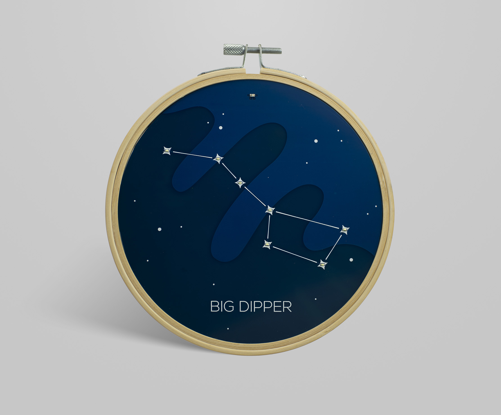  
 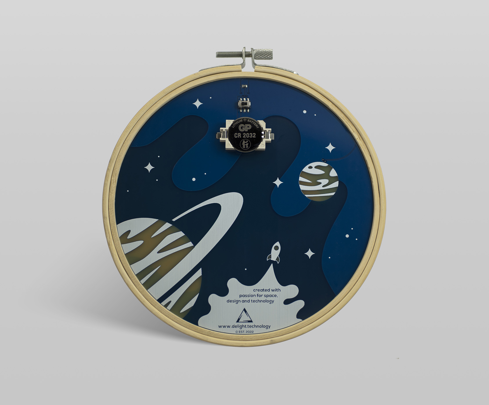
 
  
The Big Dipper is a well-known constellation in the northern hemisphere. Inspired by embroidered hoops with stars or zodiac signs that you can find on Etsy and put as a wall decoration, I decided that I would create my own version based purely on PCBs. The super cool thing is that each star is an LED and lights up automatically when it is getting dark thanks to phototransistor in the front.
    
You can find it on Etsy:
https://www.etsy.com/shop/DelightTechnology

  
 
## Steps of designing
1. [KiCad project](#1-kicad-project)
2. [Vector project of the design](#2-Vector-project-of-the-design)
3. [InkScape with Svg2Shenzhen](#3-InkScape-with-Svg2Shenzhen)
4. [Export to KiCad](#4-Export-to-KiCad)
5. [More photos](#5-More-photos)
* [License](#License)

## 1. KiCad project
The first step was to create a schematic in KiCad to have a picture of how all the components should be connected: button battery, resistors, LEDs, switch and phototransistor.

 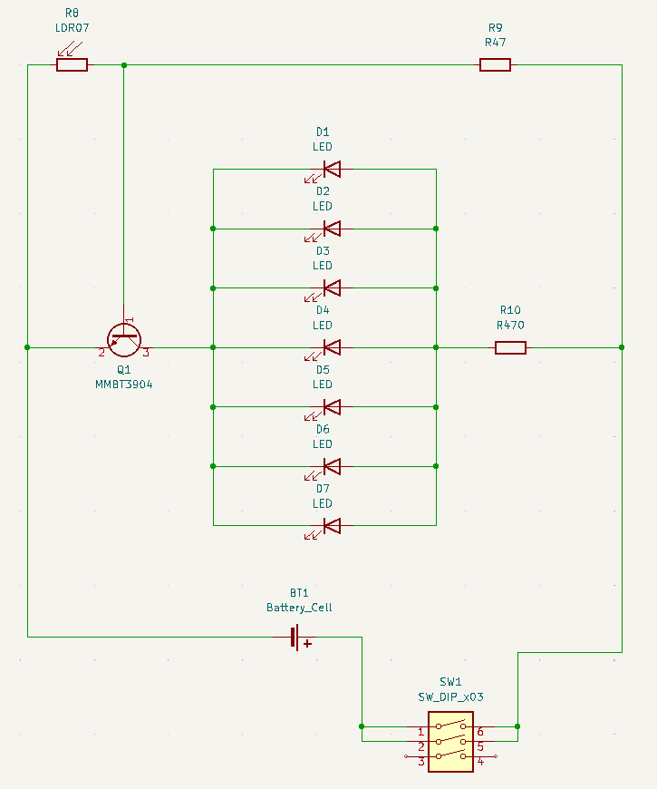

## 2. Vector project of the design
Then I had to design the appearance of the constellation taking into account that we have only 5/6 colors (PCB levels and coatings) to use. Of course, the holes in the copper layer had to coincide exactly with those on the other side so that the correct paths and "drill holes" could be routed later.

Front of the design:  
 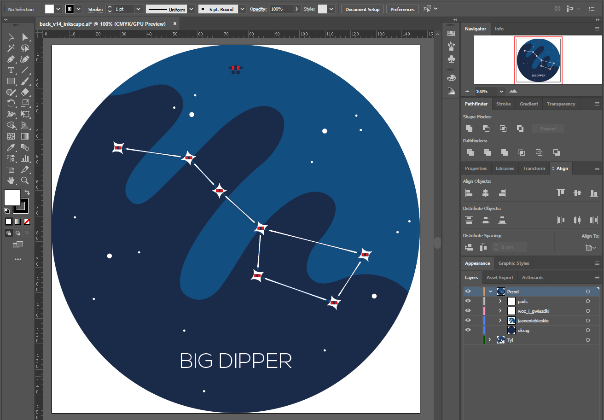

Back of the design:  
 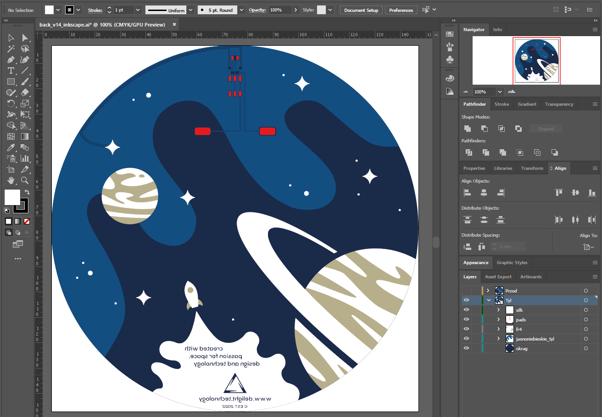

## 3. InkScape with Svg2Shenzhen
To create a PCB definition for KiCad from a vector project, you need to install the Svg2Shenzhen plug-in for InkScape, which you can find at THIS link. I then imported the previously created project into InkScape and layered it - I recommend this video to better understand how to use Svg2Shenzhen:

InkScape with Svg2Shenzhen design front: 
 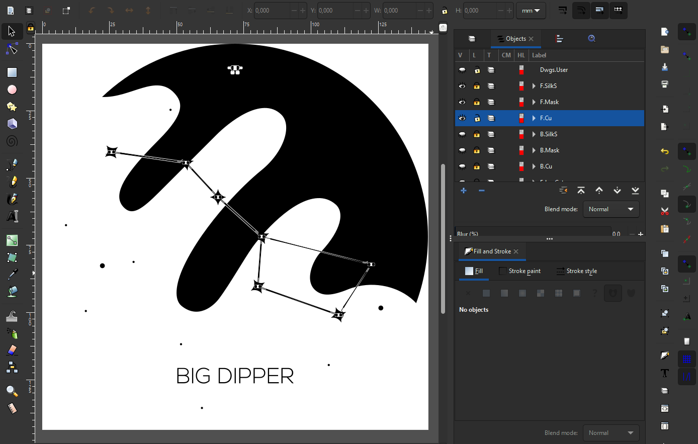

InkScape with Svg2Shenzhen design back: 
 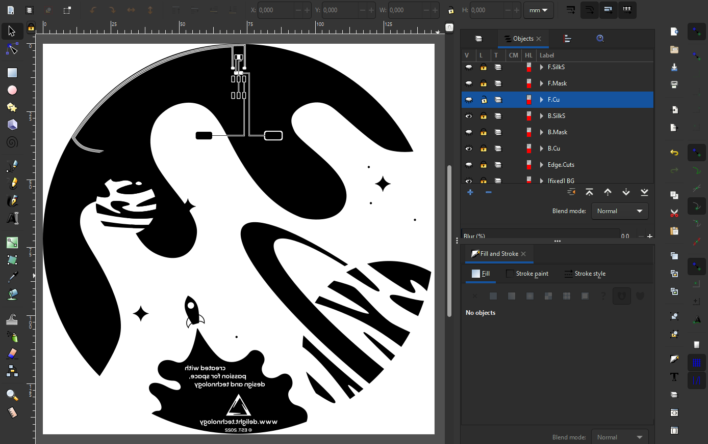

## 4. Export to KiCad
After a successful export to KiCad, our design looks like the one below. The only thing to do is to finish the path connections and add drill holes. Generate a gerber file of the design prepared this way and you can send it to production.

 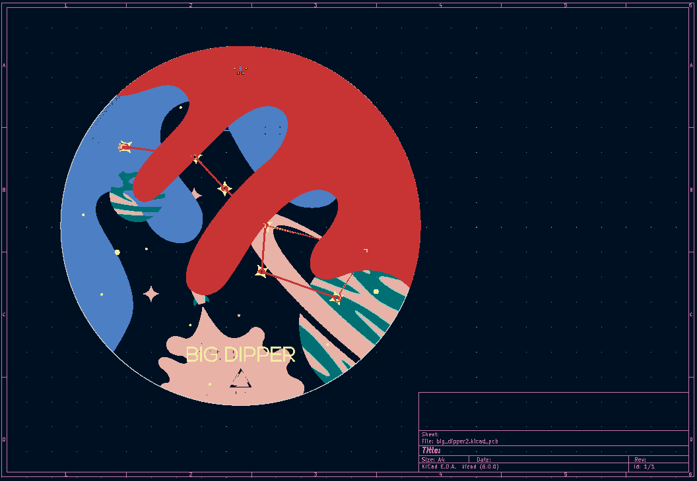

## 5. More photos

 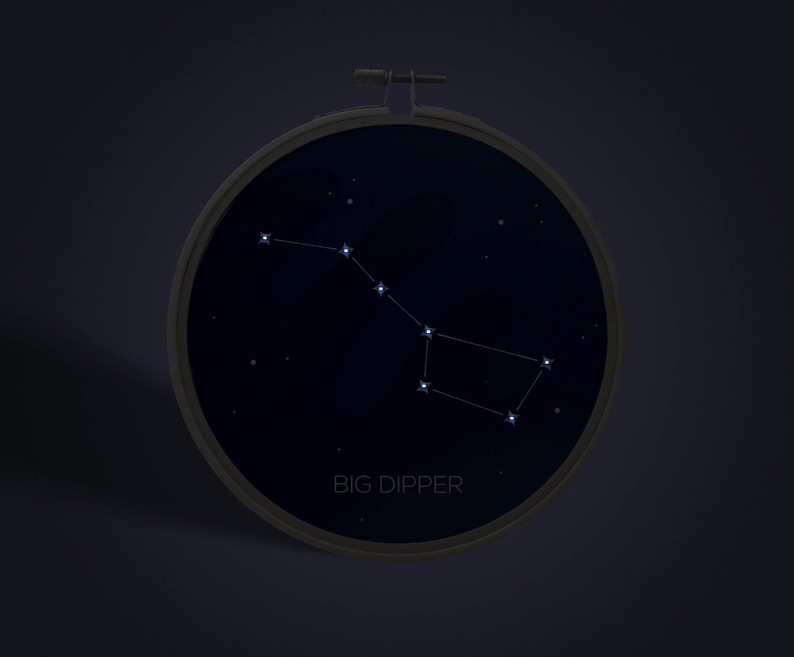  
 
 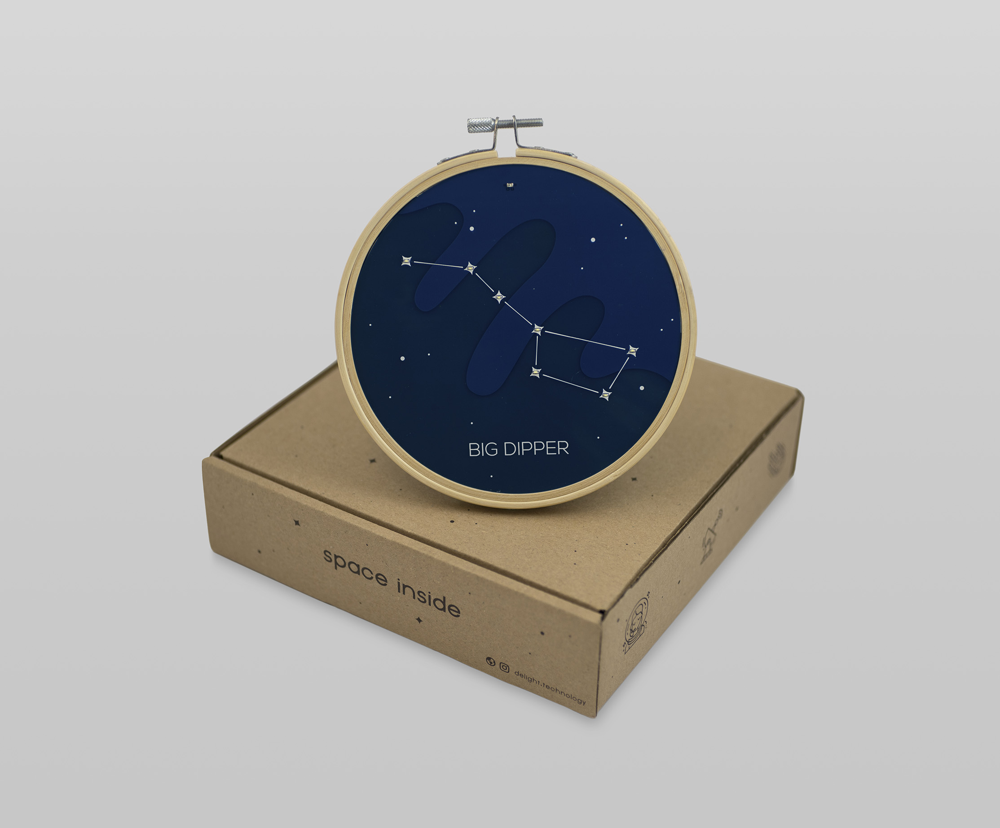  
 
   

 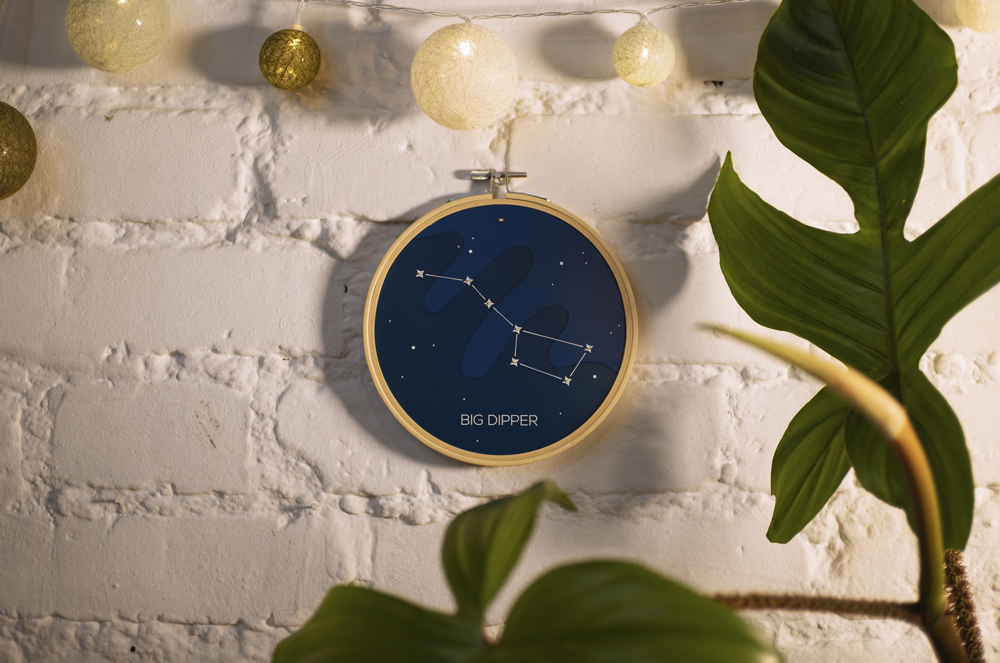  

 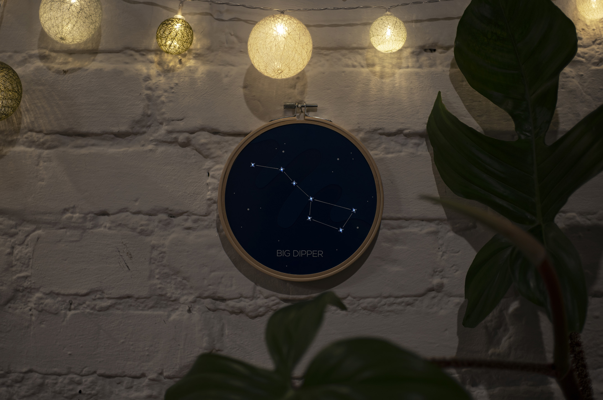  

## License

Copyright © 2023, [Andrzej Strzala](https://www.linkedin.com/in/andrzejstrzala/).
